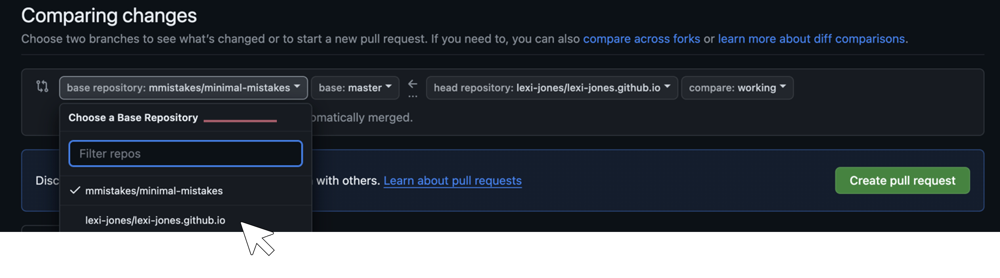
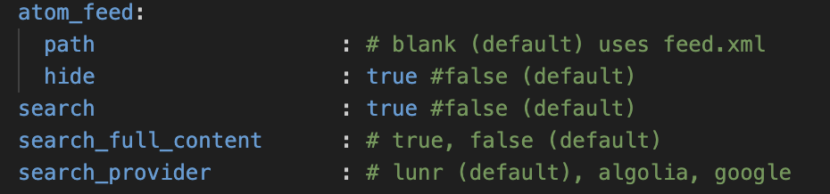

I think an appropriate first post is to describe how I built this website, hopefully making it easier for you than it was for me. My goal is for the website to be a landing page with links to my professional pages, include information about my research, and host blog posts like this one. For the design, I wanted something minimalistic and streamlined so that I did not have to make a lot of adjustments over time. 

I was drawn to using GitHub Pages as my website builder because my work is computational, and GitHub is the most trusted platform to host code. Although this route is not as user-friendly as others (e.g. Squarespace, Wix, etc.), it is free, and my website URL matches my GitHub page. As a bonus, it inherently requires extra practice using GitHub and Git commands, which I am always trying to get better at.

If you’re ok with a little pain and a lot of gain, follow along to make your own GitHub website! 

## Setup

Free, pre-designed [templates from Jekyll](https://jekyllthemes.io/free) can be directly incorporated into a GitHub Pages website. I chose the [Minimal Mistakes](https://jekyllthemes.io/theme/minimal-mistakes) theme, then clicked the button `Get Minimal Mistakes on GitHub` at the top of the landing page.

<figure>
  
</figure>

I tried a few options described [here](https://mmistakes.github.io/minimal-mistakes/docs/quick-start-guide/), but the easiest method was to fork the repository from GitHub. 

<figure>
  
</figure>

For your site, you should name the forked repository `[github-username].github.io`. I tested naming it something other than my GitHub username and ran into problems building the website. Next, I went to my GitHub page, navigated to the new repository called `[github-username].github.io` and went to the `Settings` tab. I set the `Default branch` to `master`. Then I clicked `Pages` on the sidebar under `Code and automation`. I chose `Deploy from a branch` from the `Source` drop-down and set it to `master`. Then I was able to deploy the site by clicking `Visit site`. 

<figure>
  
</figure>

At first, the site is an exact replica of the Jekyll template. Following Jekyll’s recommendation, I cleaned up the repository by removing the following folders and files that aren’t needed for my personal website:
- `.editorconfig`
- `.gitattributes`
- `.github`
- `/docs`
- `/test`
- `CHANGELOG.md`
- `minimal-mistakes-jekyll.gemspec`
- `README.md`
- `screenshot-layouts.png`
- `screenshot.png`

## Customization

Now the fun part - customizing the website! 

### Making Changes with Git
I created a working branch on Git to push edits to the master branch. I originally tried to edit directly in the master branch on GitHub but ran into problems doing that. This [video tutorial](https://www.youtube.com/watch?si=4PQOFV7EqcTB9wRE&v=QyFcl_Fba-k&feature=youtu.be) shows you how to edit the website with the text editor [Visual Studio Code](https://code.visualstudio.com/) and Git commands. If you’re not familiar with Git, they also have a [video series](https://www.youtube.com/watch?v=3RjQznt-8kE&list=PL4cUxeGkcC9goXbgTDQ0n_4TBzOO0ocPR&index=3&ab_channel=NetNinja) to get you started.

Here is a basic workflow:
1. Create a working branch: `git checkout -b [branch-name]`
2. Make changes to the website in Visual Studio Code in the working branch
3. Push the changes: 
 - `git add .`
 - `git commit -m [message]`
 - `git push origin [branch-name]`
4. Create a pull request to the main branch on GitHub. Changes to the website should appear in a few minutes.

After pushing changes to the master branch, be careful that your pull request is directed to your base repository (`[github-username].github.io`) and **not** the originally forked repository (`mmistakes/minimal-mistakes`), or any other for that matter.

<figure>
  
</figure>

### Making Changes with Git
The first thing I did was edit the `_config.yml` file. There I chose a [skin](https://github.com/mmistakes/minimal-mistakes?tab=readme-ov-file#skins-color-variations) (color variations) by changing `minimal_mistakes_skin : [“skin-name”]`. I also filled in things like the website title name, author information, and the links for the sidebar and footer. [This blog](https://renatogolia.com/2020/10/22/creating-this-blog-theme/) describes some of these customizations specifically for the Minimal Mistakes theme. 

Buried in the Minimal Mistakes [Configuration page](https://mmistakes.github.io/minimal-mistakes/docs/configuration/) there is information about how to hide the annoying feed button that shows up in the footer. In the `_config.yml` file, I `CTRL+F` searched for `atom_feed`, and set `hide: true`. Right under that parameter, I also set `search : true`, which enables the search option in the top right of the website menu.

<figure>
  
</figure>

To add a photo to my author profile, I created a subdirectory called `images` within the `assets` directory. I added a photo to the subdirectory and set `avatar: "/assets/images/[name-of-image].png"` in the `_config.yml` file. 

### Menu Options
