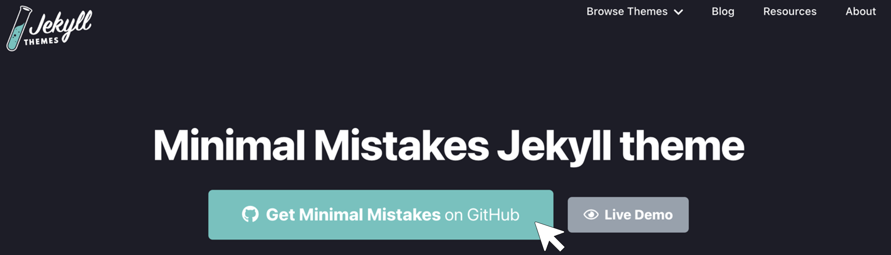
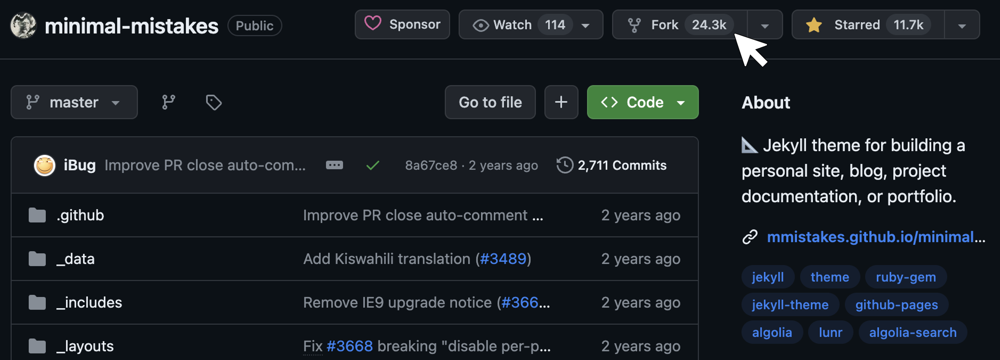
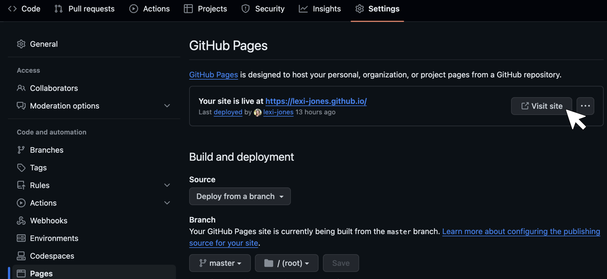
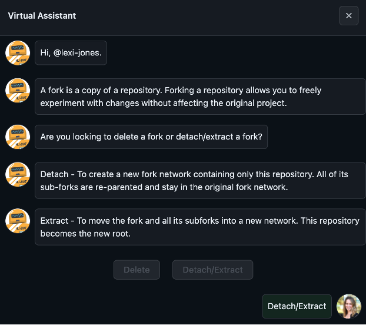
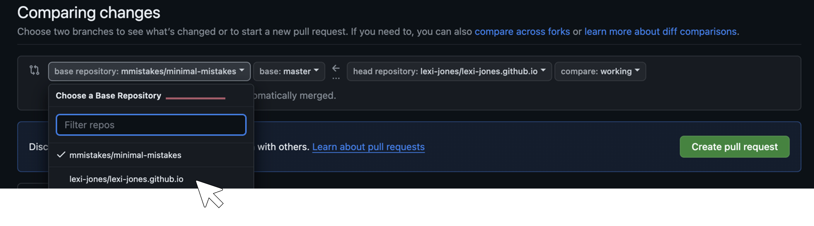
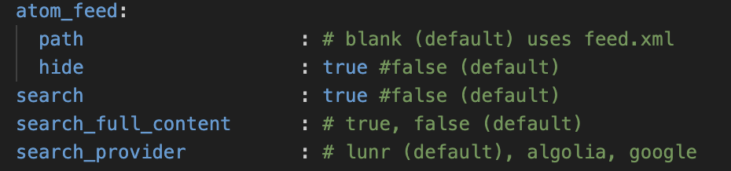
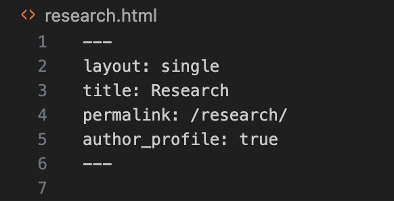
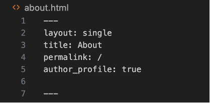
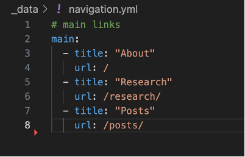

I think an appropriate first post is to describe how I built this website, hopefully making it easier for you than it was for me. My goal was to create a landing page with links to my various professional pages, include information about my research, and host blog posts like this one. For the design, I wanted something minimalistic and streamlined so that I did not have to make a lot of adjustments over time.

I was drawn to using GitHub Pages as my website builder because my work is computational. Although this route is not as user-friendly as others (e.g. Squarespace, Wix, etc.), it is free, and my website URL matches my GitHub page. As a personal bonus, building a website with GitHub inherently provides extra practice using Git commands, which I am trying to get better at.

If you’re ok with a little pain and a lot of gain, follow along to make your own GitHub website! 

## Setup

Free, pre-designed [templates from Jekyll](https://jekyllthemes.io/free) can be directly incorporated into a GitHub Pages website. I chose the [Minimal Mistakes](https://jekyllthemes.io/theme/minimal-mistakes) theme and clicked the button `Get Minimal Mistakes on GitHub` at the top of the landing page.

<figure>
  
</figure>

I tried the options described [here](https://mmistakes.github.io/minimal-mistakes/docs/quick-start-guide/), but the easiest method for me was to fork the repository from GitHub. However, there are some downsides to forking that you should be aware of that I describe in the next section. To start, you should name the forked repository `[github-username].github.io`. I tried naming it something other than my GitHub username and ran into problems building the website. You can customize the domain name later if that is of interest to you.

<figure>
  
</figure>

Next, I went to my GitHub page, navigated to the new repository called `[github-username].github.io`, and clicked the `Settings` tab. I set the `Default branch` to `master`. Then I clicked `Pages` on the sidebar under `Code and automation`. I chose `Deploy from a branch` from the `Source` drop-down and set it to `master`. Then I was able to deploy the site by clicking `Visit site`. 

<figure>
  
</figure>

At this point, it was a replica of the Jekyll template. Following Jekyll’s recommendation, I cleaned up the repository by removing the following folders and files that aren’t needed for my personal website:
- `.editorconfig`
- `.gitattributes`
- `.github`
- `/docs`
- `/test`
- `CHANGELOG.md`
- `minimal-mistakes-jekyll.gemspec`
- `README.md`
- `screenshot-layouts.png`
- `screenshot.png`

### Caveats to the Fork Method

One of the downsides to forking is that your project remains attached to the original repository (in this case, `mmistakes/minimal-mistakes`). Forking on GitHub is typically used to make new developments to code that are eventually merged back into the original repository. However, in the case of making a personal website, there is no intention of doing this.

There are a few security concerns with a fork. For example, commits in a repository within a fork network can be accessed from any other repository in the same network. At the time of my writing this, the fork network of Minimal Mistakes is 24.3k! In the worst-case scenario, the owner of the original repository has admin permission to delete the fork and its branches. You can read more about fork security [here]( https://docs.github.com/en/pull-requests/collaborating-with-pull-requests/working-with-forks/about-permissions-and-visibility-of-forks). 

When the repository exists as a fork, there will be this message at the top of your repository: “This branch is X commits ahead of `mmistakes/minimal-mistakes:master`”. Again, this is because GitHub assumes that you eventually will want to commit the changes back to the original repository. Further, if you make a pull request directly on GitHub, you will see that you have access to both the base repository and other forks.

I wanted my repository to be independent of the base repository, so I submitted a detach/extract fork request with GitHub Support [here](https://support.github.com/request/fork).

<figure>
  
</figure>
The Virtual Assistant asked why I wanted to detach the fork, and in this case, it is because “The repository was initially based on a boilerplate or template repository”. Then GitHub Support created a ticket for the request, and it was approved in a day and a half. Yay! Now my fork is detached and behaves as its entirely own repository.

I recognize that this fork and then detach method is a clunky way of building a website. However, when I tried to install the theme as a Ruby gem, as described [here]( https://mmistakes.github.io/minimal-mistakes/docs/quick-start-guide/), I ran into a package installation error. If you’re using a Windows device, it is even more annoying to go the Ruby gem route, as described in [this blog](https://renatogolia.com/2020/10/10/creating-this-blog-editor/). Play around with the options and figure out what works for you. The good news is that once the website is set up, you will never have to go through these steps again.

## Customization

Now the fun part - customizing the website! 

### Making Changes with Git
This [video tutorial](https://www.youtube.com/watch?si=4PQOFV7EqcTB9wRE&v=QyFcl_Fba-k&feature=youtu.be) shows you how to edit the website with the text editor [Visual Studio Code](https://code.visualstudio.com/) and Git commands. If you’re not familiar with Git, they also have a [video series](https://www.youtube.com/watch?v=3RjQznt-8kE&list=PL4cUxeGkcC9goXbgTDQ0n_4TBzOO0ocPR&index=3&ab_channel=NetNinja) to get you started.

Here is a basic workflow:
1. Create a working branch: `git checkout -b [branch-name]`
2. Make changes to the website in Visual Studio Code in the working branch
3. Push the changes: 
 - `git add .`
 - `git commit -m [message]`
 - `git push origin [branch-name]`
4. Create a pull request to the main branch on GitHub. Changes to the website should appear in a few minutes.

**Warning if you did not detach your fork:** After pushing changes to the master branch, be careful that your pull request is directed to your base repository (`[github-username].github.io`) and not the originally forked repository (`mmistakes/minimal-mistakes`), or any other, for that matter.

<figure>
  
</figure>

### Basic Information and Settings
The first customization I did was edit the `_config.yml` file. There I chose a [skin](https://github.com/mmistakes/minimal-mistakes?tab=readme-ov-file#skins-color-variations) (or color variations) by changing `minimal_mistakes_skin : [“skin-name”]`. I also filled in the website title name, author information, and the links for the sidebar and footer. [This blog](https://renatogolia.com/2020/10/22/creating-this-blog-theme/) describes some of these customizations specifically for the Minimal Mistakes theme. 

One issue I noticed with the footer was a feed button that led to a broken webpage. Buried in the Minimal Mistakes [Configuration page](https://mmistakes.github.io/minimal-mistakes/docs/configuration/) there is information about how to hide this button. In the `_config.yml` file, I `CTRL+F` searched for `atom_feed`, and set `hide: true`. Right under that parameter, I also set `search : true`, which enables the search option in the top right of the website menu.

<figure>
  
</figure>

To add a photo to my author profile, I created a subdirectory called `images` within the `assets` directory. I added a photo to the subdirectory and set `avatar: "/assets/images/[name-of-image].png"` in the `_config.yml` file. 

### Menu Options
To create the navigable pages on the top of my website, I created an `.html` file in the root of my repository for each one, following [this blog](https://blog.webjeda.com/new-page-jekyll/). The content of the files look something like this:

<figure>
  
</figure>

The section in between the triple dashes is referred to as the page’s "YAML Front Matter". The URLs in the `/_data/nativation.yml` file need to match the permalink parameter in the Front Matter. The layout for each page can be selected from presets built into the Minimal Mistakes template, described here. By setting `author_profile : true`, the author profile will show on the page as long as the layout allows it. Everything below the dashed line is the content that will appear on the page. You can follow this [GitHub guide]( https://docs.github.com/en/get-started/writing-on-github/getting-started-with-writing-and-formatting-on-github/basic-writing-and-formatting-syntax) for tips on HTML syntax.

I wanted to make my main landing page the same, whether users click the website title or the About page in the header of the website. To do so, I deleted the `index.html` file and set  `permalink: /`  in the Front Matter of `about.html`:

<figure>
  
</figure>

I updated the URL in `/_data/nativation.yml` to match the new permalink:

<figure>
  
</figure>

### Posts
